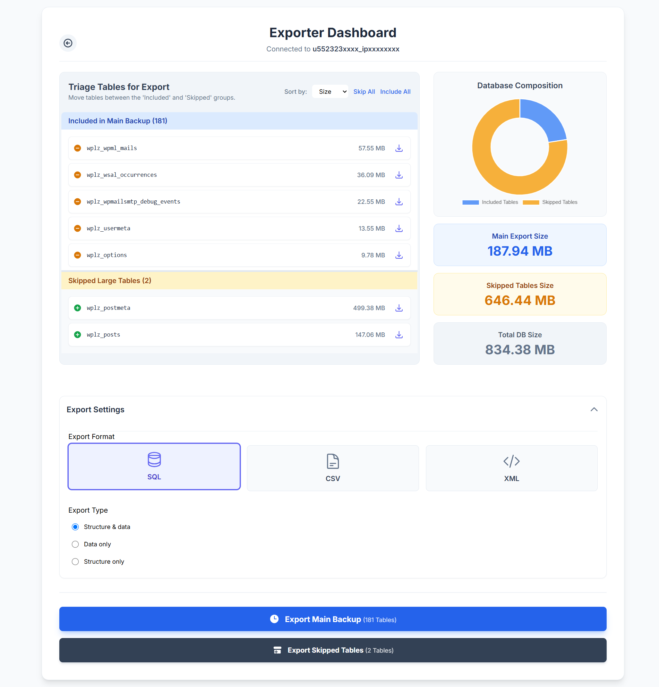

# 🚀 Dumpsky Advance (`DumpskyAdv.php`)

Welcome to **Dumpsky Advance**, a modern, single-file, web-based utility for analyzing, triaging, and exporting MySQL/MariaDB databases with real-time progress. Built with PHP, Vanilla JS, and Tailwind CSS.

### Why is Dumpsky Advance useful?

In a world of complex developer tools, sometimes you need a simple, powerful, and self-contained solution. This database exporter was built to solve common frustrations with database management:

* **⚡️ Speed and Simplicity:** No need to install a heavy desktop client or navigate complex command-line tools. Just drop the `DumpskyAdv.php` file on your server, and you're ready to go.
* **🧠 Intelligent Table Management:** Large log files or cache tables can make backups unwieldy. The "Triage" system allows you to instantly identify and skip these large tables, resulting in smaller, more manageable backups for migration or development.
* **💎 Visual Feedback:** Stop guessing if your export is still running. The live progress bar and status updates, powered by Server-Sent Events, give you complete visibility into the process, especially for databases that take minutes to export.
* **🛡️ Safe & Secure:** It operates within your server environment, so your database credentials are never exposed to third-party services. It uses prepared statements for initial analysis and focuses on read-only operations.
* **🧰 Ultimate Flexibility:** Whether you need a full SQL dump for a server migration, a few CSV files for a data analyst, or just the structure of a single table for a new project, this tool handles it all from one clean interface.

---

## ✨ Major Features

* **Multiple Export Formats:** Export your data as **SQL**, **CSV**, or **XML**.
* **Intelligent Table Triage:** Automatically identifies large tables and allows you to easily move them to a "skipped" list to keep your main backup lean.
* **Real-Time Export Progress:** A live progress bar and status messages show you exactly what's happening during the export, preventing timeouts and uncertainty.
* **Granular Export Control:** Export the full database, only the tables you've selected for inclusion, or just the tables you've chosen to skip. You can even export a single table directly.
* **Data Visualization:** A dynamic pie chart shows the size composition of your included vs. skipped tables, helping you understand your database at a glance.
* **Self-Contained Single File:** The entire application—backend, frontend, and styling—is in one PHP file for maximum portability.

---

## 📋 All Features

#### Backend (PHP)
* **Configuration & Debugging:** `DEBUG_MODE` for logging server errors to a file without exposing them publicly.
* **Prerequisite Checks:** Ensures required PHP extensions like `mysqli` and `ZipArchive` are available.
* **Chunked Processing:** Reads and writes data in small chunks to handle massive tables without running out of memory.
* **Asynchronous Operations:** Uses Server-Sent Events (SSE) to push live progress to the frontend.
* **Export Cancellation:** Safely stop an in-progress export, which also deletes any partially created backup files.
* **Advanced CSV/ZIP Handling:** Automatically bundles multi-table CSV exports into a convenient `.zip` archive.
* **Secure Session Management:** Stores connection details securely in the server-side session during use.

#### Frontend (JavaScript & CSS)
* **Modern UI:** Clean and responsive interface built with **Tailwind CSS**.
* **Single-Page Feel:** Smooth screen transitions without full page reloads.
* **Interactive Dashboard:** Manage table lists with drag-and-drop-like ease, sort tables by name or size, and see stats update in real-time.
* **Local Storage Persistence:** Remembers your last connection settings (except the password) for quick access next time.
* **Skeleton Loader:** A "shimmer" loading animation provides a better user experience while the database is being analyzed.
* **Context-Aware Settings:** UI options adapt based on your choices (e.g., structure/data options only appear for SQL exports).

---

## 🛠️ How to Use

Follow these simple steps to get Dumpsky Advance running.

#### Prerequisites
* A web server (Apache, Nginx, etc.)
* PHP 7.4 or newer
* The `mysqli` PHP extension enabled
* The `ZipArchive` PHP extension enabled (required for multi-table CSV export to ZIP)

#### Steps to Use

1.  **Download:** Download the **`DumpskyAdv.php`** file from this repository.
2.  **Upload:** Place the single `DumpskyAdv.php` file in a secure, web-accessible directory on your server. **Important:** For security, it's highly recommended to place this in a password-protected directory (`.htaccess`) or in a location that is not publicly guessable.
3.  **Navigate:** Open the script's URL in your web browser (e.g., `https://yourdomain.com/secure-folder/DumpskyAdv.php`).
4.  **Connect:**
    * Enter your database host, name, username, and password.
    * Select a size threshold to automatically identify and skip large tables.
    * Click **"Connect & Analyze"**.
5.  **Triage & Configure:**
    * On the dashboard, review the "Included" and "Skipped" table lists. Click the `+` or `-` buttons to move tables between the lists.
    * Open the "Export Settings" panel to choose your format (**SQL**, **CSV**, **XML**) and other options.
6.  **Export:**
    * Click **"Export Main Backup"** to download the tables in the "Included" list.
    * Alternatively, click **"Export Skipped Tables"** to download just the large tables you set aside.
    * Watch the real-time progress bar.
    * When complete, a download button will appear. Click it to save your backup file.

